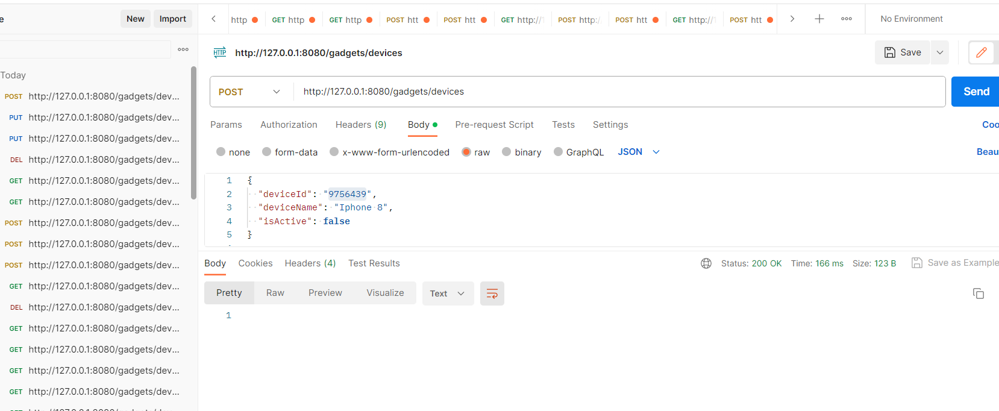
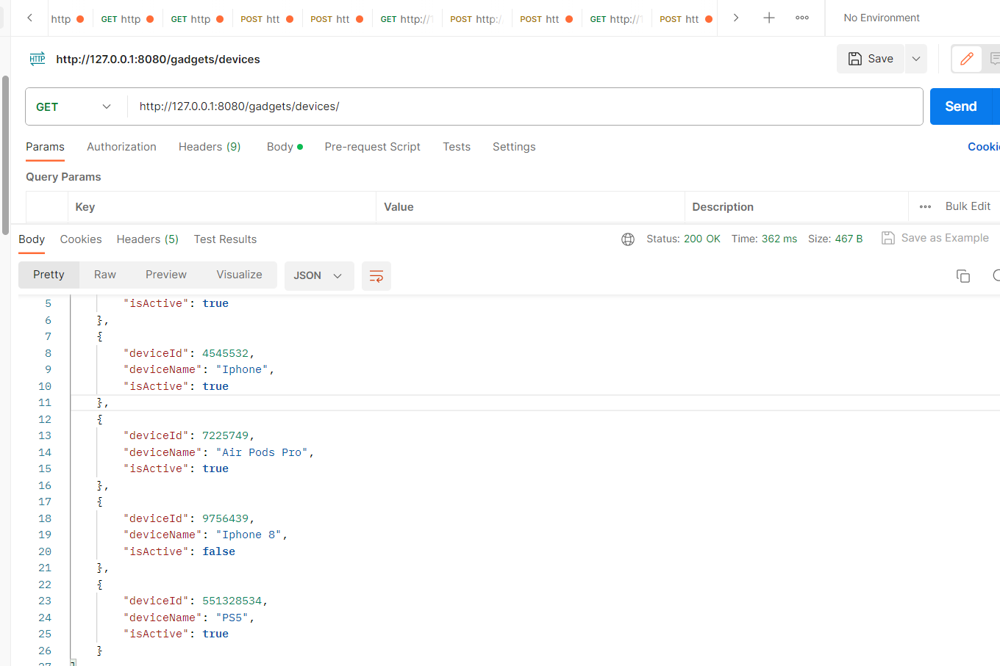

## UPDATE-Frontend
Find the frontend of the Gadget Manager project here [Gadget Manager Frontend Repository](https://github.com/thibedi-phathela/GadgetManager-Frontend). 

#  Gadget Manager
Gadget Manager is a RESTful API for managing gadgets/devices. It allows you to add and keep track of your priceless devices,  With Gadget Manager, you can easily organize and manage your collection of gadgets, making it convenient to retrieve information about each device whenever you need it.

# Used
- Java
- Spring Boot
- Spring Web
- Maven 
- MySQL

# API Endpoints
Get all devices
-   GET /gadgets/devices

Get a specific device 
-   GET /gadgets/devices/{deviceId}

Add a device
-   POST /gadgets/devices

Update a specific device
-   PUT /gadgets/devices/{deviceId}

Remove a device
-   DELETE /gadgets/devices/{deviceId}

# Sample endpoints using Postman:

POST /gadgets/devices

GET /gadgets/devices

